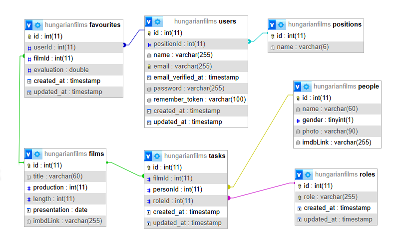

# A feladat leírása!
- csv formátumban forrásként megkaptuk a két világhború közzött gyártott magyar filmek adatbázisát amiben a filmek és készítőik szerepőik találhatók.
- Ezt kiegészítve, kibővítve célunk egy olyan webalkalmazás készítése ahol ezeket az adatokat szerkeszthessük kiegészítsük videólinkekkel fotókkal és imdb hivatkozásokkal.
    - Feladatunk egy jelentős része gyűjtőmunka is lessz ahol videókat, fotókat kell megkeresni letölteni és bevinni az datbázisba.
- Az így feltöltött adatbázis célja hogy az oldalon regisztrált felhasználó böngészhesse nézhesse a hozzátartozó videókat és egyéb hivatkozásokat valamint kigyűjthesse a neki tetsző alkotásokat egy erre kailakított felületen.
- Az alkalmazás három szerepkörre készül, amiknek megfelelő módon férhet hozzá a tartalmakhoz. 
    - Admin (az adatbázis feltöltését karbantartását végzi)
    - Guest (böngészés, keresés valamint a kedvencek kigyűjtése)
    - Az oldalon nem regisztrált felhasználó csak böngészhet

 - A feladatot mySQL adatbázissal, laravel alapú backend, vue.js alapú frontend és a csoportmunkát git, github technológiával valósítjuk meg. 
 - A feladat megvalósításának része a backend s frontend tesztek elkészítése valamint az alkalmazás teljes dokumentációjának létrehozása
 - A feladat csoportmunkában készült.
    - Csoportvezető: Polyák Alex János
    - Csapattag: Hajdu István 
 - A projekt ütemezéséhez, feladat megosztásához, egymás közti kommunikációhoz a github projekt tervező felületét valamit a teams-t használjuk.   

# Adatbázis

## Diagarm

## positions table (Pozíció)
- Ebben a táblázatban találhatóak meg a usereknek a "poziciója" azaz hogy a user milyen szerepet tölt be: Admin vagy Guest
- id
- name (a poziciójának a megnevezése) admin avagy nem (guest)

## users (felhasználók)
- id
- name (név: a felhasználó neve)
- positionId (pozicioId: ezt a positions-ból kapja meg)

## films (filmek)
- id
- title (cím: a filmnek a címe)
- production (gyártás: a film forgatásának kezdési éve)
- lenght (hossz: a filmnek a hossza)
- presentation (bemutato: a film kiadási éve)
- imdbLink (a filmhez tartozó link az imdb-ről)

## videos (videók)
- id
- filmId (ezt a films táblázatból kapja meg)
- link (YouTube-on a linkje, de nem biztos hogy van minden filmhez)
- embedLink (beágyazásiLink: Ez a beágyazási linkje persze ez csak akkor van ha fent van a YouTube-on)

## favourites (kedvencek)
(a felhasználóknak a kedvenc filmjei itt lesznek találhatóak)
- id
- userId (ezt a users táblázatból kapja meg)
- filmId (ezt a films táblázatból kapja meg)
- evaluation (ertekeles: a filmre adott értékelése)

## roles (szerepkörök)
- id
- role (szerepkor: a szerepkör megnevezése(színész, operatőr...stb))

## people (emberek(színészek, rendezők...stb))
- id
- name (a személy neve)
- gender (neme: a személynek a neme)
- photo (foto: fotó az illetőről, ha van)
- imdbLink (igazából itt meg ha van leírás a személyról akkor a linket találhatod meg itt)

## tasks (feladatok)
- id
- filmId (ezt a films táblázatból kapja meg)
- personId (szemelyId: ezt a people táblázatból kapja meg)
- roleId (szerepkorId: ezt a roles táblázatból kapja meg)

