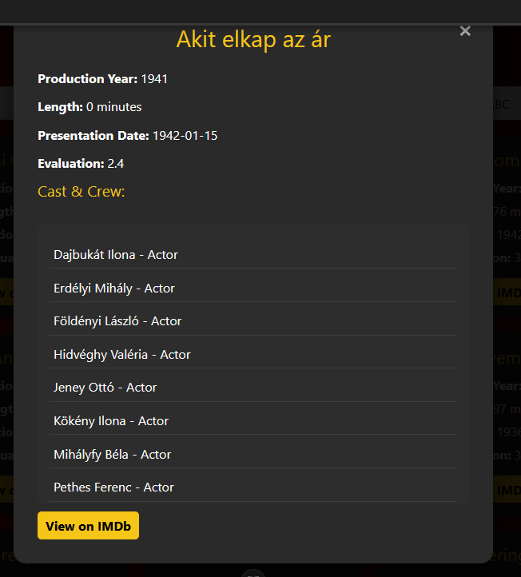

# A program leírása
## Főoldal

### Films
(Bejelentkezés nélkül)
- megjelennek a kártyák
    - keresni lehet és 
    - sorrendbe rakni
    - meg lehet nézni a film imdb-linkjét

(Bejelentkezés után)

- Itt ltható hogy a bejelentkezés után hogy néz ki az oldal de itt még nem admin szerepkörrel.

(Filminfó)

(Bejelentkezés mint Admin)

- Tisztán látható hogy az admin szerepkörrel felruhászott illető tudja törölni, szerkeszteni az adott filmet, de hozzá is adhat a listába egy új filmet.

(Filminfó mint admin)

- A film kártyára rányomva felugrik nekünk ez az ablak ahol szerkeszteni lehet a filmnek az infoját. A stábot lehet itt pontosabban, hozzáadni, törölni és szerkeszteni.

### People

- Ha bejelentkezett ha nem az illető ez az oldal ugyan úgy funkcionál mindkét opciónál. Itt láthatjuk a színészeket, operatőröket...stb. Akiről nem találtunk képet vagy linket azok is itt vannak. 

- Ha az illető admin szerepkörrel van ellátva akkor megjelennek neki itt is a gombok melyekkel tudja szerkeszteni az itt lévő embereket...stb.

### Reviews 
- A reviews fülre kattintva felugrik nekünk a reviews oldal. 
    - Itt van két rész. My Reviews és All Reviews. Míg a my reviews-nél csak a saját értékelést és hozzászólást látjuk addíg az all reviews-nél a többi értékelést és hozzászólást is láthatjuk.
    - Az guest szerepkörű személy kedve szerint törölheti és szerkesztheti a véleményét, értékelését.
    - De aki nincs bejelentkezve az nem tud véleményezni vagy bármely hasonló jogot igénybe venni

- All Reviews

- My Reviews

# Hitelesítés
## Bejelentkezés
- A bejelentkezéshez úgy jut el az illető rányom az Account-ra. 

- Majd a loginra kattintva

- Felugrik a login ablak

## Logout
- A logoutnál ugyan ott mint a loginnél csak a logoutra kattintva

## Regisztráció
- U.A- mint a login csak annyi külömbséggel, hogy a login helyett a registration-ra nyomjunk

- rányomva magunk előtt találhatjuk a regisztráció felületét ahol egy nevet, emailt és jelszót kell átllítani. 

## Profile
- A profilban tudjuk szerkeszteni a személyes adatainkat mint pl.: email cím, jelszó...stb

- A profil szerkesztésének felülete
